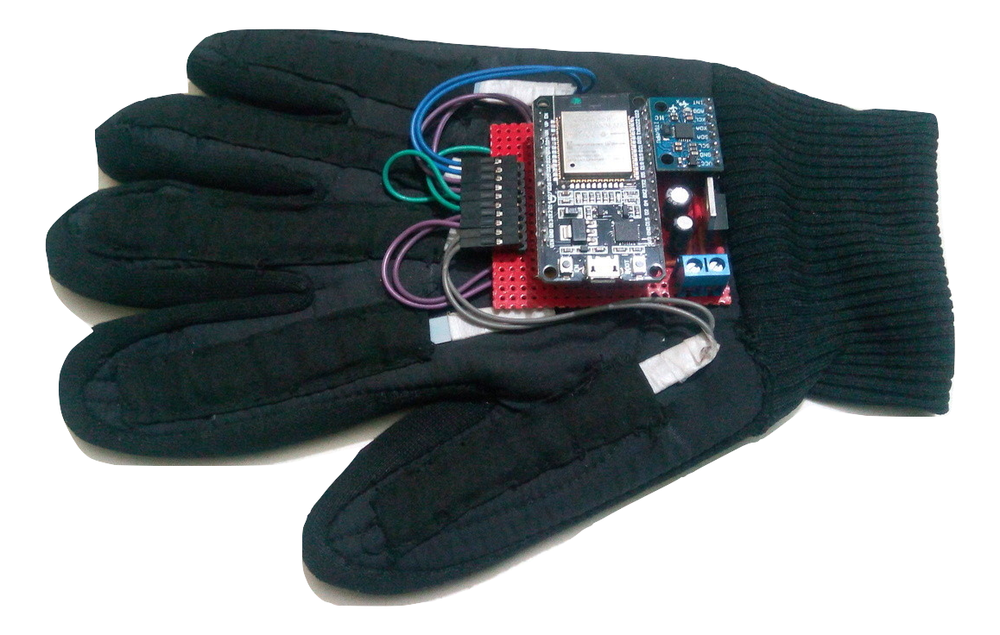

# Hand Gesture Classification  
  

 
 
 

  
  

 
 

### Abstract
Currenty the device classifies `14` different gestures using `8` features. `5 flex sensor` data for each finger and `3` MPU6050 readings for `3D` orientation.

### 1. Contents
- [Hello World (MNIST)](https://github.com/atick-faisal/Project-Dilbar-4.1/tree/master/Hello%20World%20(MNIST))
- [Processing Software](https://github.com/atick-faisal/Hand-Gesture-Classification/tree/master/Desktop_Software)
- [ESP32 Codes](https://github.com/atick-faisal/Hand-Gesture-Classification/tree/master/ESP32_Codes/ESP32_MPU6050)
- [Logistic Regression Classifier](https://github.com/atick-faisal/Hand-Gesture-Classification/tree/master/Logistic_Classifier)
- [KNN Classifier](https://github.com/atick-faisal/Hand-Gesture-Classification/tree/master/KNN_Classifier)
- [SVM Classifier](https://github.com/atick-faisal/Hand-Gesture-Classification/tree/master/SVM_Classifier)
- [Python Serial Output](https://github.com/atick-faisal/Hand-Gesture-Classification/tree/master/Python_Serial)

### 2. Dependencies
  #### Python 3.5
    - Numpy
    - Matplotlib
    - Pandas
    - Scikit-Learn
    - Jupyter Notebook
  #### ESP-32
    - Wire

## License

This work is licensed under [GNU General Public License v3.0](https://github.com/atick-faisal/PIC16F877a/blob/master/LICENSE).
